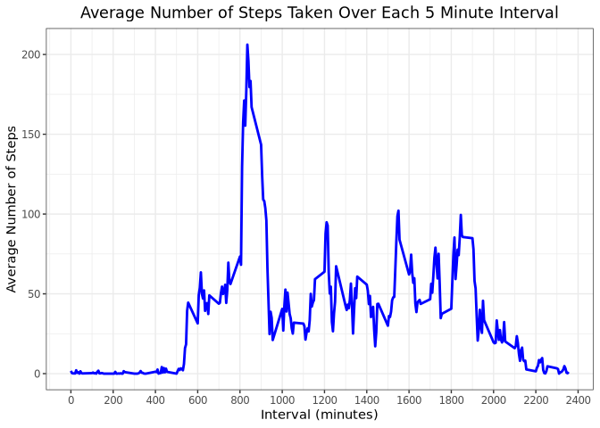

## Loading and preprocessing the data

Prior to the analysis, we must first load the data and clean it.


```r
# Load the necessary packages
library(tidyverse)

# Load the data
activity_data <- read_csv('activity.csv')

# Glimpse the unprocessed data
activity_data %>% glimpse()
```

```
## Observations: 17,568
## Variables: 3
## $ steps    <dbl> NA, NA, NA, NA, NA, NA, NA, NA, NA, NA, NA, NA, NA, NA, NA, …
## $ date     <date> 2012-10-01, 2012-10-01, 2012-10-01, 2012-10-01, 2012-10-01,…
## $ interval <dbl> 0, 5, 10, 15, 20, 25, 30, 35, 40, 45, 50, 55, 100, 105, 110,…
```

Notice that the `date` column has already been converted into a `Datetime`
object by the `read_csv` function, so our data preprocessing has been handled
for us. We'll leave the `NA`s alone for now.

## What is mean total number of steps taken per day?

In order to obtain this value we need to obtain the total number of steps for
each day.


```r
# Get total number of steps per day
total_steps_per_day <- activity_data %>%
	group_by(date) %>%
	summarize(total_steps = sum(steps))

# Display the values
total_steps_per_day
```

```
## # A tibble: 61 x 2
##    date       total_steps
##    <date>           <dbl>
##  1 2012-10-01          NA
##  2 2012-10-02         126
##  3 2012-10-03       11352
##  4 2012-10-04       12116
##  5 2012-10-05       13294
##  6 2012-10-06       15420
##  7 2012-10-07       11015
##  8 2012-10-08          NA
##  9 2012-10-09       12811
## 10 2012-10-10        9900
## # … with 51 more rows
```

Note the `NA`s. We will be explicitly ignoring them in our calculation of the
mean and median total steps taken per day. By this it is meant that the `NA`
values will be removed from the calculation.


```r
# Get the mean and median total steps
total_steps_per_day %>%
	summarize(mean_total_steps = mean(total_steps, na.rm = T),
			  median_total_steps = median(total_steps, na.rm = T))
```

```
## # A tibble: 1 x 2
##   mean_total_steps median_total_steps
##              <dbl>              <dbl>
## 1           10766.              10765
```

In order to get a sense of the distribution of the total number of steps taken
each day, we'll create a histogram.


```r
# Histogram of the total steps taken per day
total_steps_per_day %>% ggplot(aes(total_steps)) +
	geom_histogram(color = 'black', fill = 'grey') + theme_bw() +
	labs(title = 'Histogram of the Total Number of Steps Per Day',
		 x = 'Steps', y = 'Frequency') +
	theme(plot.title = element_text(hjust = 0.5))
```


## What is the average daily activity pattern?

We'll start by making a line plot of the average number of steps for each five
minute interval.


```r
# Plot the average number of steps for each five minute interval
activity_data %>% group_by(interval) %>%
	summarize(avg_steps = mean(steps, na.rm = T)) %>%
	ggplot(aes(interval, avg_steps)) +
	geom_line(color = 'blue', size = 1) +
	scale_x_continuous(breaks = seq(0, 2400, 200)) +
	theme_bw() +
	labs(title = 'Average Number of Steps Taken Over Each 5 Minute Interval',
		 x = 'Intervals', y = 'Average Number of Steps') +
	theme(plot.title = element_text(hjust = 0.5))
```



From the plot we can see that the interval with the largest average number of
steps is around 830.

## Imputing missing values

Before we attempt to imput missing values, let's count just how many rows with
missing values there are in our dataset.


```r
# Get the total number of missing values in the dataset
activity_data %>% is.na() %>% sum()
```

```
## [1] 2304
```

Since this is a comparatively small number of rows and we know that the missing
values are all in the steps column, we can employ a simple method of imputing
missing values, namely substituting the median value of the steps column.


```r
# Replace missing values in steps column with median
steps_median <- activity_data$steps %>% median(na.rm = T)
activity_data_imputed <- activity_data %>%
    replace_na(replace = list(steps = steps_median))

# Display the new dataframe with the imputed values
activity_data_imputed %>% head()
```

```
## # A tibble: 6 x 3
##   steps date       interval
##   <dbl> <date>        <dbl>
## 1     0 2012-10-01        0
## 2     0 2012-10-01        5
## 3     0 2012-10-01       10
## 4     0 2012-10-01       15
## 5     0 2012-10-01       20
## 6     0 2012-10-01       25
```

We can see here that the `NA`s in the original dataset have been replaced with
the median of the `steps` column which happens to be 0. Let's see how these
imputed values affect the distribution, mean, and median of the `steps` column.


```r
# Create histogram of total number of steps taken per day
total_steps_imputed <- activity_data_imputed %>%
    group_by(date) %>%
    summarize(total_steps = sum(steps))

total_steps_imputed %>% ggplot(aes(total_steps)) +
    geom_histogram(color = 'black', fill = 'grey') +
    theme_bw() +
    labs(title = 'Histogram of Total Steps Per Day with Imputed Values',
         x = 'Steps', y = 'Frequency') +
    theme(plot.title = element_text(hjust = 0.5))
```


```r
# Calculate the mean and median total steps
total_steps_imputed %>%
    summarize(mean_total_steps = mean(total_steps),
              median_total_steps = median(total_steps))
```

```
## # A tibble: 1 x 2
##   mean_total_steps median_total_steps
##              <dbl>              <dbl>
## 1            9354.              10395
```

We see from the plot that the imputed values create a spike on the left side
where all of the values at or close to zero are. We also see from the results of
the mean and median computation that, while the median is unaffected the mean
decreased.

## Are there differences in activity patterns between weekdays and weekends?
